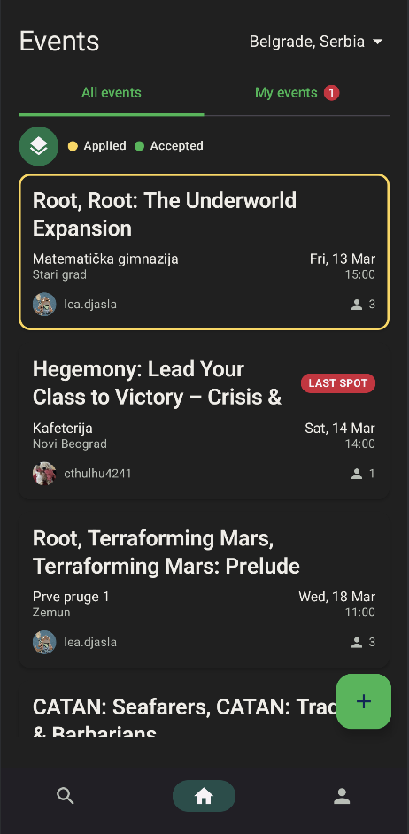
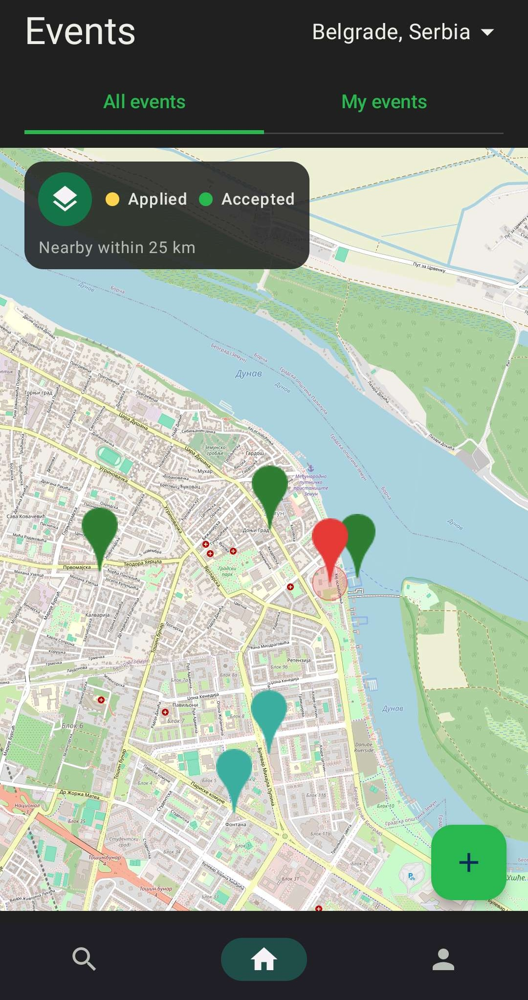
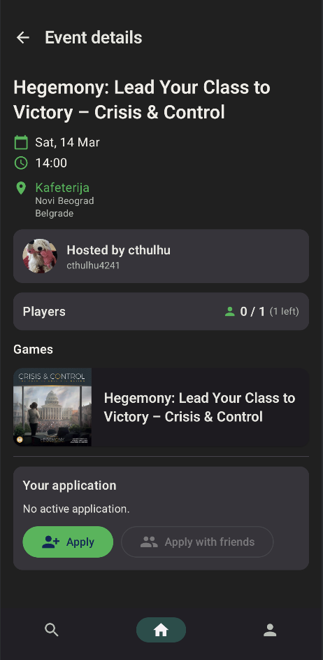
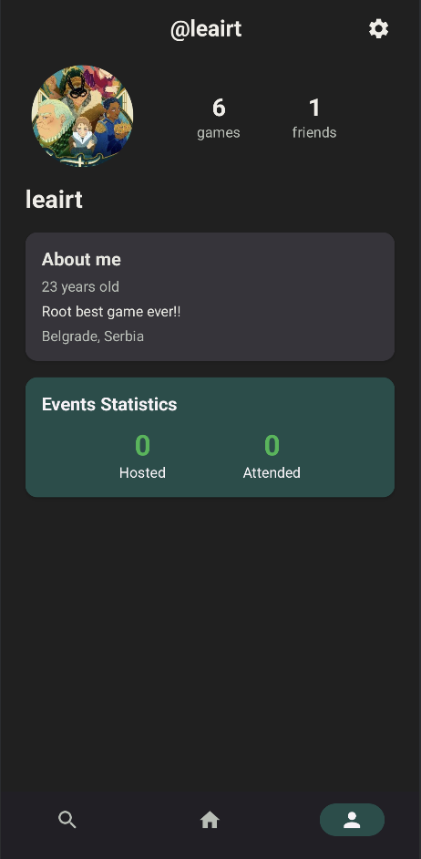
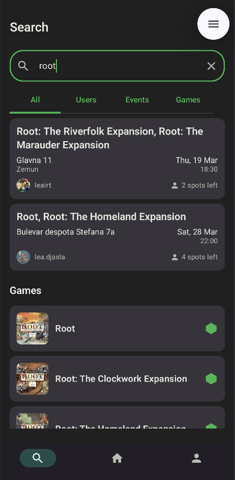
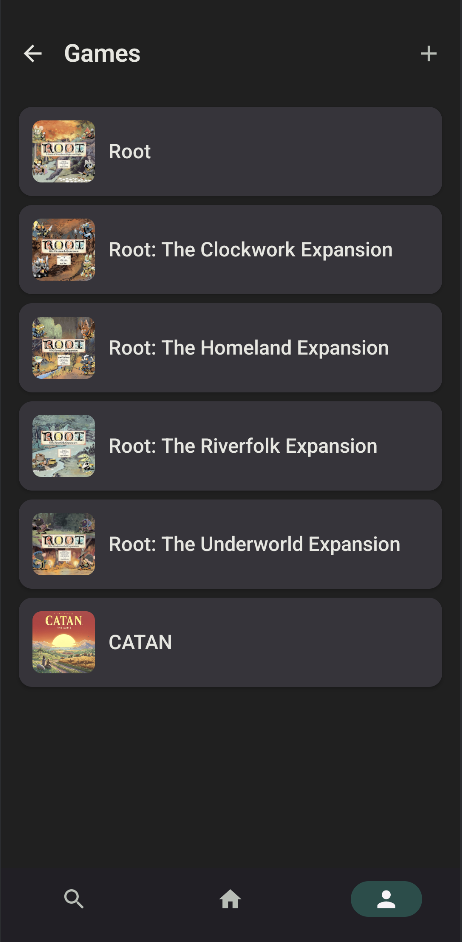
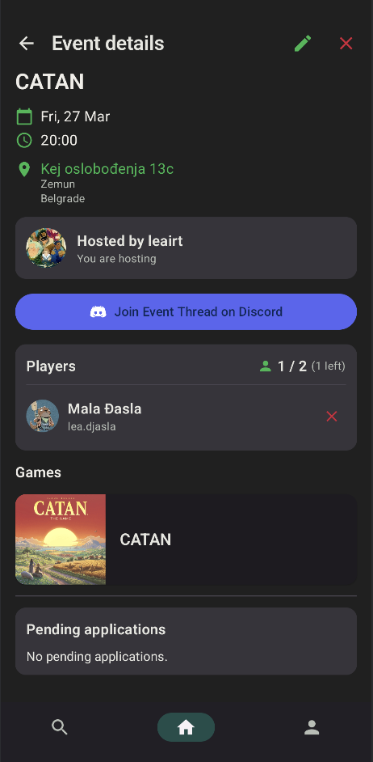
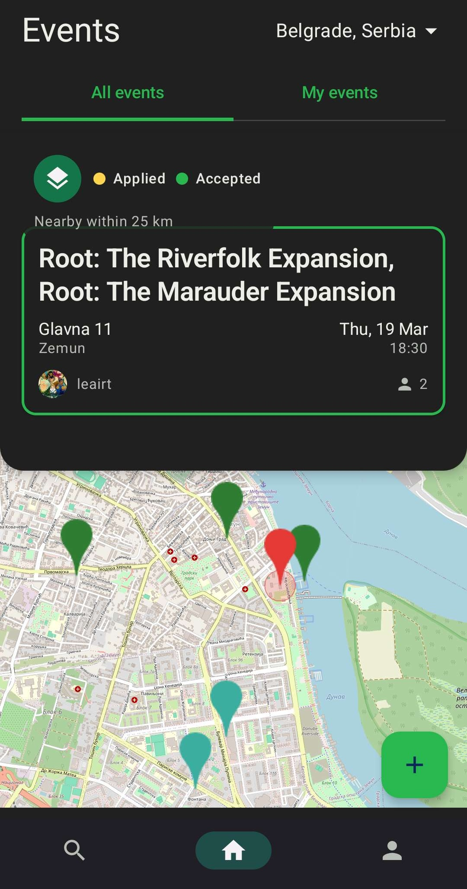
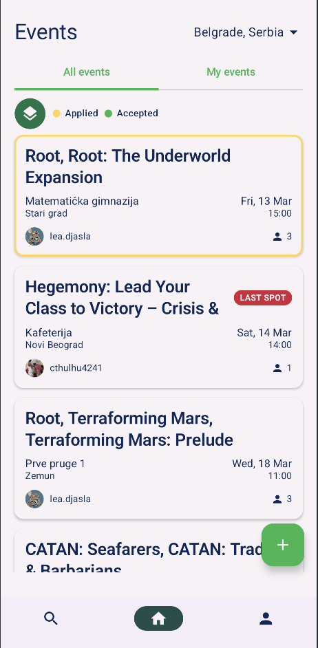

# Druzabac

**Find players. Join events. Play together.**

Druzabac is an Android application that helps board game enthusiasts find fellow players in their city by organizing and joining local board gaming events.

Modern board games can be complex, rules are extensive, and finding enough players to make a game enjoyable is surprisingly difficult. You might only know one or two friends who know how to play a particular game, while many games require larger groups to truly shine. Board game cafes have been growing in popularity, but even there you need to arrive with an already-formed group -- they don't solve the core problem of finding players.

Druzabac bridges that gap by providing a platform where players can create events, discover nearby sessions, and coordinate through Discord integration.

> **Note:** This project is currently a work in progress and is not a final product. Features and UI are subject to change.

---

## Screenshots

<!-- Add your screenshots or GIFs below. Recommended size: 300px width for phone screenshots. -->

| Home Screen (List View) | Home Screen (Map View) | Event Details |
|:-----------------------:|:----------------------:|:-------------:|
|  |  |  |

| User Profile | Search | Game Collection |
|:------------:|:------:|:---------------:|
|  |  |  |

| Event Details (Host View) | Map Details |
|:-------------------------:|:-----------:|
|  |  |

| Light Theme | Dark Theme |
|:-----------:|:----------:|
|  |  |

---

## Features

### Authentication
- Sign in with your Discord account via OAuth 2.0
- User profiles with avatar, bio, city, and personal details
- Import your profile picture from Discord or upload from gallery
- Track your event hosting and attendance statistics

### Event Management
- Create events by selecting games, location, date/time, and player count
- Browse events in your chosen city
- Apply to join events individually or together with friends
- Hosts can accept or decline applications and finalize the lineup
- Smart sorting -- open events first, friend-hosted events prioritized, ordered by date
- Status badges: NEW for recent events, LAST SPOT when one seat remains
- Event lifecycle: OPEN, FINALIZED, CANCELLED

### Social
- Send and accept friend requests
- View other users' profiles, game collections, and event history
- Followers and following lists
- Real-time notifications for friend requests, event applications, and status updates

### Discord Integration
- A Discord bot automatically creates a private thread for every new event
- Accepted participants are added to the thread automatically
- One-tap button to open the event's Discord thread directly from the app
- Coordinate with other players without leaving Discord

### Game Library
- Browse a curated database of board games with images and descriptions
- Build your personal game collection
- Add custom games that are not yet in the database
- View detailed game information

### Location
- Cities organized with districts for precise event placement
- City picker during registration
- Events filtered and displayed by city

### User Interface
- Light and dark theme toggle
- Material Design 3 aesthetics
- Bottom navigation with five main sections: Home, Search, Create Event, Notifications, Profile
- Responsive layouts for different screen sizes

---

## Architecture

Druzabac follows a serverless architecture, communicating directly with cloud services from the Android client.

### Tech Stack

| Layer | Technology |
|-------|-----------|
| Language | Kotlin |
| UI Framework | Jetpack Compose |
| Design System | Material Design 3 |
| Database | Firebase Firestore |
| Authentication | Discord OAuth 2.0 (WebView) |
| Messaging | Discord Bot API |
| Image Loading | Coil |
| Maps | OpenStreetMap (osmdroid) |
| Async | Kotlin Coroutines and Flows |
| Local Storage | SharedPreferences |
| Build System | Gradle (Kotlin DSL) |
| Min SDK | 24 (Android 7.0) |
| Target SDK | 35 |

### Data Flow

The application uses Firebase Firestore as its primary data store. Data is stored in JSON-like documents organized into collections. Cities and board games are pre-populated in the database, while users and events are created through the app.

Real-time Firestore snapshot listeners keep the UI in sync with the database, so changes made by other users (new events, accepted applications, friend requests) are reflected immediately.

---

## Getting Started

### Prerequisites

- Android Studio (latest stable version)
- A Firebase project with Firestore enabled
- A Discord application with OAuth 2.0 configured
- A Discord bot with appropriate permissions

## License

Copyright (c) 2026. All rights reserved.

This is a personal project created and developed by [Lea Irt](https://github.com/leairt). The original idea and concept were created by [Lea Irt](https://github.com/leairt) and [Bogdan Đukic](https://github.com/bgdj11).

No part of this project may be reproduced, distributed, or used without explicit permission from the authors.
